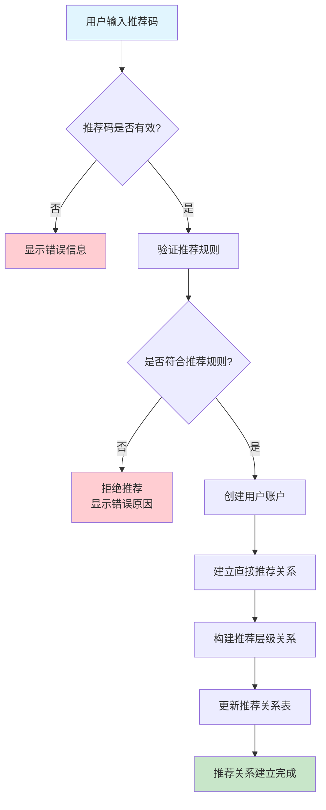
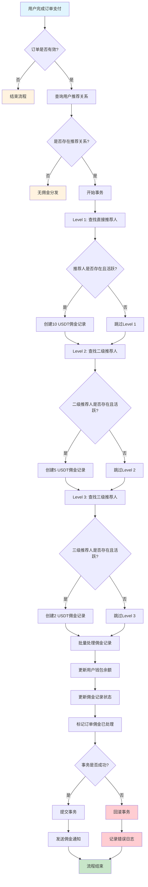
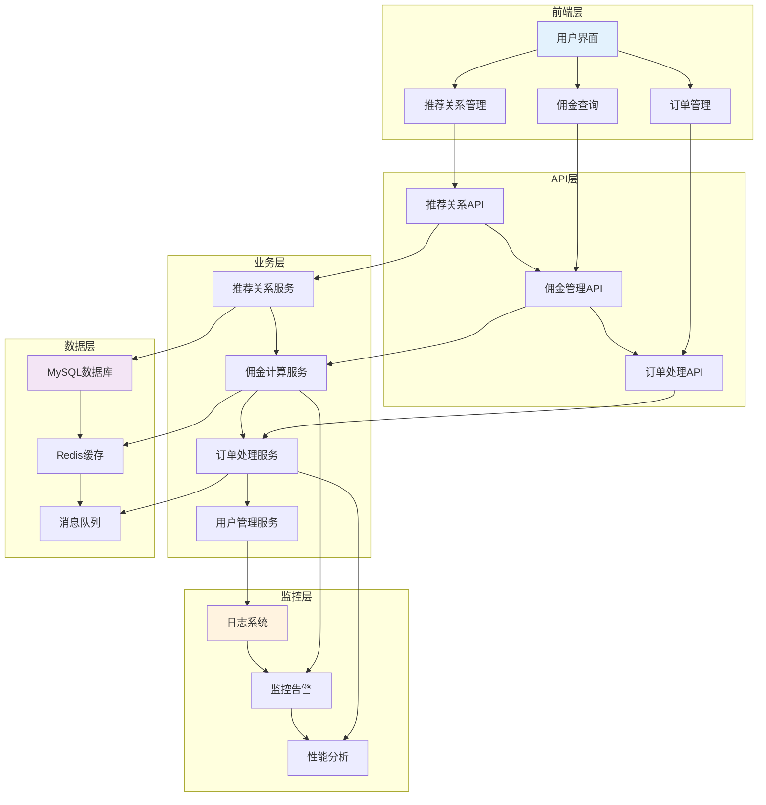

# 三级返佣系统设计文档

## 文档信息

| 项目 | 内容 |
|------|------|
| 文档名称 | 三级返佣系统设计方案 |
| 版本 | v1.0 |
| 创建日期 | 2025-01-09 |
| 更新日期 | 2025-01-09 |
| 编写者 | 系统架构师 |
| 审核者 | 待定 |

## 1. 概述

### 1.1 项目背景

本文档描述了一个基于RuoYi框架的三级返佣系统设计方案。该系统旨在为加密货币交易平台提供多层级的用户推荐奖励机制，通过建立用户推荐关系链条来激励用户推广平台，提高用户活跃度和平台交易量。

### 1.2 系统目标

- **建立三级推荐体系**：支持用户A→用户B→用户C的三级推荐关系
- **自动化佣金分发**：当用户产生有效购买时，自动向上级推荐人分发佣金
- **固定返佣比例**：一级推荐人获得10 USDT，二级推荐人获得5 USDT，三级推荐人获得2 USDT
- **高性能架构**：支持高并发交易和佣金计算
- **数据完整性**：确保佣金记录准确无误，可追溯

### 1.3 业务规则

#### 1.3.1 推荐关系规则
- 用户通过推荐码建立推荐关系
- 推荐关系一经建立不可更改
- 禁止循环推荐和自我推荐
- 推荐关系最多支持三级深度

#### 1.3.2 佣金分发规则
- 仅在用户完成有效购买后触发佣金分发
- 佣金分发按层级递减：L1(10 USDT) → L2(5 USDT) → L3(2 USDT)
- 佣金即时到账，计入用户钱包余额
- 支持佣金历史记录查询和统计

#### 1.3.3 安全控制
- 防止重复处理同一订单的佣金
- 用户状态校验（仅活跃用户可接收佣金）
- 交易原子性保证
- 完整的审计日志记录

### 1.4 技术架构

- **框架基础**：RuoYi SpringBoot框架
- **数据库**：MySQL 8.0+
- **缓存**：Redis
- **消息队列**：RabbitMQ
- **监控**：Prometheus + Grafana
- **设计模式**：领域驱动设计（DDD）

## 2. 数据库表结构设计

### 2.1 用户表 (users)

用户基础信息表，包含推荐关系的直接引用。

```sql
CREATE TABLE users (
    id BIGINT PRIMARY KEY AUTO_INCREMENT COMMENT '用户ID',
    username VARCHAR(50) UNIQUE NOT NULL COMMENT '用户名',
    email VARCHAR(100) UNIQUE NOT NULL COMMENT '邮箱',
    referral_code VARCHAR(20) UNIQUE NOT NULL COMMENT '推荐码',
    referrer_id BIGINT COMMENT '推荐人ID',
    wallet_balance DECIMAL(20,8) DEFAULT 0 COMMENT '钱包余额',
    status ENUM('active', 'inactive') DEFAULT 'active' COMMENT '用户状态',
    created_at TIMESTAMP DEFAULT CURRENT_TIMESTAMP COMMENT '创建时间',
    updated_at TIMESTAMP DEFAULT CURRENT_TIMESTAMP ON UPDATE CURRENT_TIMESTAMP COMMENT '更新时间',
    
    FOREIGN KEY (referrer_id) REFERENCES users(id),
    INDEX idx_referrer_id (referrer_id),
    INDEX idx_referral_code (referral_code),
    INDEX idx_status (status)
) ENGINE=InnoDB DEFAULT CHARSET=utf8mb4 COMMENT='用户表';
```

### 2.2 推荐关系表 (referral_relationships)

存储用户之间的推荐关系层级结构，支持高效的祖先查询。

```sql
CREATE TABLE referral_relationships (
    id BIGINT PRIMARY KEY AUTO_INCREMENT COMMENT '关系ID',
    ancestor_id BIGINT NOT NULL COMMENT '祖先用户ID',
    descendant_id BIGINT NOT NULL COMMENT '后代用户ID',
    level_depth INT NOT NULL CHECK (level_depth >= 1 AND level_depth <= 3) COMMENT '层级深度',
    referral_path VARCHAR(255) NOT NULL COMMENT '推荐路径，格式：1/2/3',
    status ENUM('active', 'inactive') DEFAULT 'active' COMMENT '关系状态',
    created_at TIMESTAMP DEFAULT CURRENT_TIMESTAMP COMMENT '创建时间',
    
    FOREIGN KEY (ancestor_id) REFERENCES users(id),
    FOREIGN KEY (descendant_id) REFERENCES users(id),
    UNIQUE KEY unique_relationship (ancestor_id, descendant_id),
    INDEX idx_ancestor_id (ancestor_id),
    INDEX idx_descendant_id (descendant_id),
    INDEX idx_level_depth (level_depth)
) ENGINE=InnoDB DEFAULT CHARSET=utf8mb4 COMMENT='推荐关系表';
```

### 2.3 订单表 (orders)

存储用户订单信息，作为佣金计算的触发源。

```sql
CREATE TABLE orders (
    id BIGINT PRIMARY KEY AUTO_INCREMENT COMMENT '订单ID',
    user_id BIGINT NOT NULL COMMENT '用户ID',
    order_number VARCHAR(50) UNIQUE NOT NULL COMMENT '订单号',
    amount DECIMAL(20,8) NOT NULL COMMENT '订单金额',
    currency VARCHAR(10) DEFAULT 'USDT' COMMENT '货币类型',
    status ENUM('pending', 'paid', 'cancelled') DEFAULT 'pending' COMMENT '订单状态',
    commission_processed BOOLEAN DEFAULT FALSE COMMENT '佣金是否已处理',
    created_at TIMESTAMP DEFAULT CURRENT_TIMESTAMP COMMENT '创建时间',
    updated_at TIMESTAMP DEFAULT CURRENT_TIMESTAMP ON UPDATE CURRENT_TIMESTAMP COMMENT '更新时间',
    
    FOREIGN KEY (user_id) REFERENCES users(id),
    INDEX idx_user_id (user_id),
    INDEX idx_status (status),
    INDEX idx_commission_processed (commission_processed)
) ENGINE=InnoDB DEFAULT CHARSET=utf8mb4 COMMENT='订单表';
```

### 2.4 佣金记录表 (commission_records)

记录每一笔佣金的详细信息，包括来源、去向、金额等。

```sql
CREATE TABLE commission_records (
    id BIGINT PRIMARY KEY AUTO_INCREMENT COMMENT '记录ID',
    order_id BIGINT NOT NULL COMMENT '触发订单ID',
    recipient_user_id BIGINT NOT NULL COMMENT '接收佣金用户ID',
    payer_user_id BIGINT NOT NULL COMMENT '产生佣金用户ID',
    commission_amount DECIMAL(20,8) NOT NULL COMMENT '佣金金额',
    commission_level INT NOT NULL CHECK (commission_level >= 1 AND commission_level <= 3) COMMENT '佣金层级',
    commission_rate DECIMAL(20,8) NOT NULL COMMENT '佣金标准（10/5/2 USDT）',
    status ENUM('pending', 'paid', 'failed', 'expired') DEFAULT 'pending' COMMENT '佣金状态',
    transaction_id VARCHAR(100) COMMENT '交易ID',
    created_at TIMESTAMP DEFAULT CURRENT_TIMESTAMP COMMENT '创建时间',
    processed_at TIMESTAMP NULL COMMENT '处理时间',
    
    FOREIGN KEY (order_id) REFERENCES orders(id),
    FOREIGN KEY (recipient_user_id) REFERENCES users(id),
    FOREIGN KEY (payer_user_id) REFERENCES users(id),
    INDEX idx_order_id (order_id),
    INDEX idx_recipient_user_id (recipient_user_id),
    INDEX idx_payer_user_id (payer_user_id),
    INDEX idx_status (status),
    INDEX idx_commission_level (commission_level)
) ENGINE=InnoDB DEFAULT CHARSET=utf8mb4 COMMENT='佣金记录表';
```

### 2.5 佣金配置表 (commission_config)

管理不同层级的佣金标准，支持灵活配置。

```sql
CREATE TABLE commission_config (
    id INT PRIMARY KEY AUTO_INCREMENT COMMENT '配置ID',
    level INT NOT NULL UNIQUE CHECK (level >= 1 AND level <= 3) COMMENT '层级',
    amount DECIMAL(20,8) NOT NULL COMMENT '佣金金额',
    currency VARCHAR(10) DEFAULT 'USDT' COMMENT '货币类型',
    active BOOLEAN DEFAULT TRUE COMMENT '是否启用',
    created_at TIMESTAMP DEFAULT CURRENT_TIMESTAMP COMMENT '创建时间',
    updated_at TIMESTAMP DEFAULT CURRENT_TIMESTAMP ON UPDATE CURRENT_TIMESTAMP COMMENT '更新时间'
) ENGINE=InnoDB DEFAULT CHARSET=utf8mb4 COMMENT='佣金配置表';

-- 插入默认配置
INSERT INTO commission_config (level, amount) VALUES 
(1, 10.00000000),
(2, 5.00000000),
(3, 2.00000000);
```

## 3. 核心业务流程

### 3.1 用户推荐关系建立流程



### 3.2 佣金分发核心流程



### 3.3 系统架构流程



## 4. API 接口设计

### 4.1 推荐关系管理接口

#### 4.1.1 创建推荐关系

**接口路径**: `POST /api/referrals`

**请求参数**:
```json
{
    "referralCode": "ABC123",
    "referredUserId": 100001
}
```

**响应格式**:
```json
{
    "code": 200,
    "message": "success",
    "data": {
        "referralId": 12345,
        "referrerId": 100000,
        "referredId": 100001,
        "level": 1,
        "createdAt": "2025-01-09T10:00:00Z"
    }
}
```

#### 4.1.2 查询推荐树

**接口路径**: `GET /api/referrals/{userId}/tree`

**请求参数**:
- `userId`: 用户ID
- `maxLevel`: 最大层级（可选，默认3）

**响应格式**:
```json
{
    "code": 200,
    "message": "success",
    "data": {
        "userId": 100001,
        "referralCode": "ABC123",
        "directReferrals": [
            {
                "userId": 100002,
                "username": "user2",
                "level": 1,
                "commissionEarned": "10.00"
            }
        ],
        "totalReferrals": 5,
        "totalCommissionEarned": "35.00"
    }
}
```

### 4.2 佣金管理接口

#### 4.2.1 查询佣金记录

**接口路径**: `GET /api/commissions/{userId}`

**请求参数**:
- `userId`: 用户ID
- `page`: 页码（可选，默认0）
- `size`: 每页大小（可选，默认20）
- `status`: 佣金状态（可选）

**响应格式**:
```json
{
    "code": 200,
    "message": "success",
    "data": {
        "content": [
            {
                "id": 1,
                "orderId": 20001,
                "commissionAmount": "10.00",
                "commissionLevel": 1,
                "payerUsername": "user_c",
                "status": "paid",
                "createdAt": "2025-01-09T10:00:00Z"
            }
        ],
        "totalElements": 50,
        "totalPages": 3,
        "pageNumber": 0,
        "pageSize": 20
    }
}
```

#### 4.2.2 佣金统计查询

**接口路径**: `GET /api/commissions/{userId}/summary`

**请求参数**:
- `userId`: 用户ID
- `startDate`: 开始日期（可选）
- `endDate`: 结束日期（可选）

**响应格式**:
```json
{
    "code": 200,
    "message": "success",
    "data": {
        "totalEarned": "125.00",
        "pendingAmount": "15.00",
        "paidAmount": "110.00",
        "commissionsByLevel": {
            "1": "60.00",
            "2": "40.00",
            "3": "25.00"
        },
        "monthlyTrend": [
            {"month": "2024-01", "amount": "45.00"},
            {"month": "2024-02", "amount": "80.00"}
        ]
    }
}
```

### 4.3 订单处理接口

#### 4.3.1 创建订单

**接口路径**: `POST /api/orders`

**请求参数**:
```json
{
    "userId": 100001,
    "amount": "100.00",
    "currency": "USDT"
}
```

**响应格式**:
```json
{
    "code": 200,
    "message": "success",
    "data": {
        "orderId": 20001,
        "orderNumber": "ORD20250109001",
        "userId": 100001,
        "amount": "100.00",
        "currency": "USDT",
        "status": "pending",
        "createdAt": "2025-01-09T10:00:00Z"
    }
}
```

#### 4.3.2 更新订单状态

**接口路径**: `PUT /api/orders/{orderId}/status`

**请求参数**:
```json
{
    "status": "paid",
    "transactionId": "tx_123456"
}
```

**响应格式**:
```json
{
    "code": 200,
    "message": "success",
    "data": {
        "orderId": 20001,
        "status": "paid",
        "commissionProcessed": true,
        "updatedAt": "2025-01-09T10:05:00Z"
    }
}
```

## 5. 关键注意事项

### 5.1 性能优化

#### 5.1.1 数据库优化
- **索引策略**：为推荐关系表的祖先ID、后代ID和层级深度创建复合索引
- **分区策略**：按时间对佣金记录表进行分区，提高查询效率
- **读写分离**：佣金查询使用读库，佣金计算使用写库
- **连接池优化**：配置合适的数据库连接池大小

#### 5.1.2 缓存策略
- **推荐关系缓存**：将用户的推荐关系链缓存到Redis中，减少数据库查询
- **佣金配置缓存**：将佣金配置信息缓存，避免频繁查询
- **用户信息缓存**：缓存活跃用户的基本信息
- **缓存失效策略**：设置合理的TTL和主动失效机制

#### 5.1.3 异步处理
- **消息队列**：使用RabbitMQ异步处理佣金计算
- **批量处理**：对大量佣金记录进行批量插入和更新
- **事务优化**：减少事务范围，提高并发性能

### 5.2 安全控制

#### 5.2.1 数据安全
- **SQL注入防护**：使用参数化查询，防止SQL注入攻击
- **访问控制**：严格控制API访问权限，验证用户身份
- **数据加密**：敏感数据进行加密存储
- **审计日志**：记录所有关键操作的审计日志

#### 5.2.2 业务安全
- **防重复处理**：使用数据库唯一约束和幂等性校验
- **金额校验**：严格校验佣金金额的合法性
- **状态一致性**：确保订单状态和佣金状态的一致性
- **异常处理**：完善的异常处理和错误恢复机制

#### 5.2.3 系统安全
- **限流控制**：对API请求进行限流，防止恶意攻击
- **监控告警**：实时监控系统运行状态，及时发现异常
- **备份恢复**：定期备份数据，确保数据可恢复性
- **版本管理**：严格的代码版本管理和发布流程

### 5.3 数据一致性

#### 5.3.1 事务管理
- **ACID特性**：确保数据库事务的原子性、一致性、隔离性和持久性
- **分布式事务**：在必要时使用分布式事务保证数据一致性
- **补偿机制**：设计补偿事务处理异常情况
- **并发控制**：使用乐观锁或悲观锁控制并发访问

#### 5.3.2 数据校验
- **约束检查**：数据库层面的约束检查
- **业务规则校验**：应用层面的业务规则验证
- **数据完整性**：定期检查数据完整性
- **一致性检查**：定期执行一致性检查脚本

### 5.4 可扩展性设计

#### 5.4.1 架构扩展
- **微服务架构**：将系统拆分为独立的微服务
- **水平扩展**：支持数据库和应用服务的水平扩展
- **负载均衡**：使用负载均衡器分发请求
- **容器化部署**：使用Docker和Kubernetes进行部署

#### 5.4.2 功能扩展
- **多层级支持**：支持超过三级的推荐关系
- **动态配置**：支持佣金标准的动态配置
- **多币种支持**：支持多种数字货币的佣金分发
- **个性化规则**：支持用户个性化的佣金规则

### 5.5 监控与运维

#### 5.5.1 系统监控
- **性能监控**：监控系统的CPU、内存、磁盘等资源使用情况
- **业务监控**：监控佣金分发的成功率、处理时间等业务指标
- **错误监控**：监控系统错误和异常情况
- **用户行为监控**：监控用户的推荐行为和佣金领取情况

#### 5.5.2 日志管理
- **结构化日志**：使用统一的日志格式
- **日志分级**：合理设置日志级别
- **日志轮转**：定期轮转和清理日志文件
- **集中管理**：使用ELK Stack集中管理日志

#### 5.5.3 告警机制
- **阈值告警**：设置合理的告警阈值
- **多渠道通知**：支持邮件、短信、微信等多种通知方式
- **告警升级**：建立告警升级机制
- **故障恢复**：快速故障定位和恢复流程

---

## 文档修订记录

| 版本 | 修订日期 | 修订人 | 修订内容 |
|------|----------|--------|----------|
| v1.0 | 2025-01-09 | 系统架构师 | 初始版本创建 |

---

**本文档是三级返佣系统的核心设计文档，为系统开发和实施提供技术指导。所有相关人员应严格按照本文档进行开发和测试。**